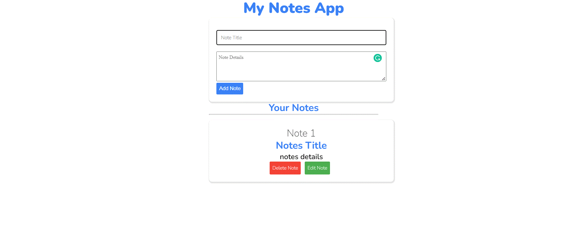

# Note Taking App
[](https://github.com/Rishi05051997)
[](https://github.com/Rishi05051997) [](https://github.com/Rishi05051997)

Note Taking App is an app that where3 user can takes note & edit that notes & delete that notes.



## Getting Started
To get started  you can simply clone this `mini-notes-taking-app` repository and install the dependencies.

Clone the `mini-notes-taking-app` repository using git:

```bash
git clone https://github.com/Rishi05051997/mini-notes-taking-app
cd mini-notes-taking-app
```

## Tech Stack
* HTML
* CSS
* JS

***Glad to see you here! Show some love by [starring](https://github.com/Rishi05051997/mini-notes-taking-app) this repo.***

[](https://www.instagram.com/rishidhatrak.dev/) [](https://www.linkedin.com/in/vrushabh-dhatrak/) 
